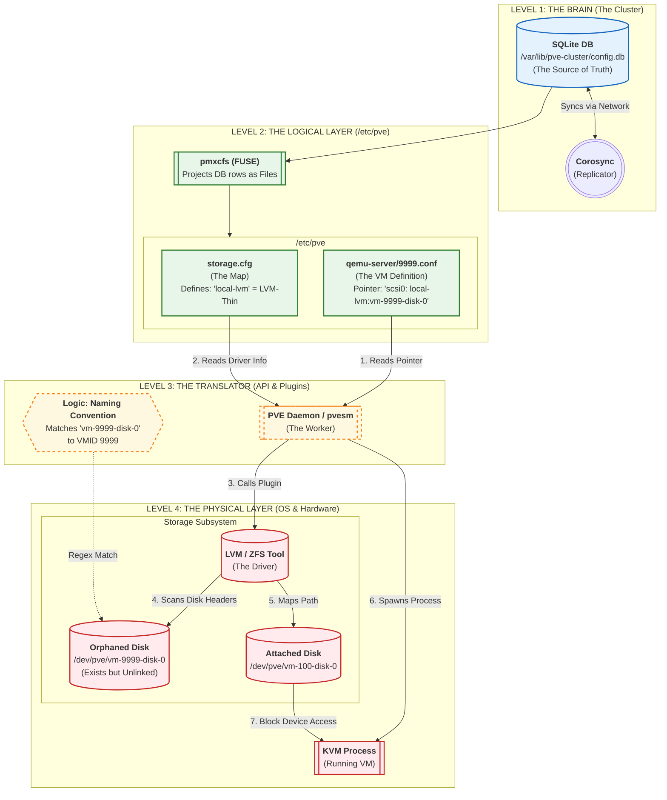
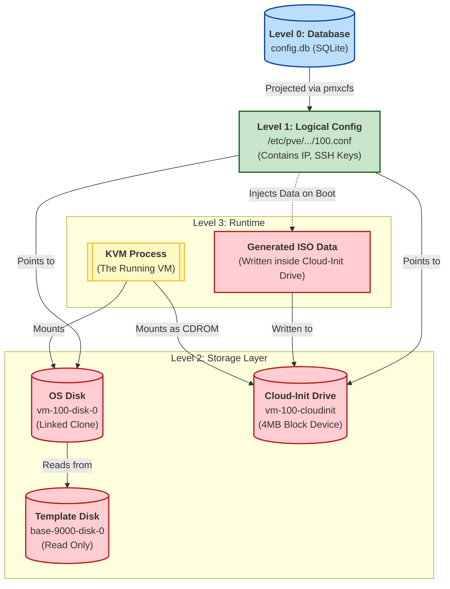

*Last updated: 301125*

I have been exploring Proxmox VE to understand how it functions internally. Specifically how it manages objects, how the API interacts with the storage subsystem, and where the "state" of the cluster actually lives.

Instead of relying on the web interface, I performed a series of tests tracing API calls, file system changes, and database interactions. This post documents those findings. Following the style of other posts on this blog, you (the reader) shouldn’t expect this to follow the structure of a user guide. What you *can* expect is a collection of notes that came out of my own testing session, random experiments aimed at getting a clearer overall picture (I took a bottom-up approach). I then fed all the notes into an LLM solely to give them a logical, linear order, which I carefully reviewed afterward. 



## The foundation: pmxcfs

Everything in Proxmox starts with a standard SQLite database. The web interface and the CLI tools do not manage text files directly, they interact with a database that projects itself as a filesystem.

The actual state of the cluster resides in `/var/lib/pve-cluster`.

```bash
root@proxmox:~# ls -l /var/lib/pve-cluster
total 36
-rw------- 1 root root 28672 Nov 30 18:23 config.db
-rw------- 1 root root 32768 Nov 30 18:23 config.db-shm
-rw------- 1 root root     0 Nov 30 18:23 config.db-wal

root@proxmox:/var/lib/pve-cluster# file config.db
config.db: SQLite 3.x database, last written using SQLite version 3046001, ...
```

This database is not read directly by the web interface. It is managed by the **pmxcfs** (Proxmox Cluster File System) daemon. This process holds the lock on `config.db` and exposes it as a FUSE (Filesystem in User Space) mount at `/etc/pve`. When you run `ls /etc/pve`, you are effectively running a SQL SELECT query. And when you run `vim /etc/pve/qemu-server/100.conf`, you are running a SQL UPDATE statement.

Writes are atomic. The transaction either succeeds completely or fails completely.

In a cluster, `pmxcfs` works with Corosync to ensure that if you write to Node A, the entry is instantly replicated to Node B and C.

This architecture allows Proxmox to implement cluster-wide locking and consistency while allowing administrators to manage the system using standard Linux file manipulation tools.



## Object classification 

One of the most important observations from the study is a distinction I made between Logical and Physical. Proxmox treats them differently.

### Primitives

| Object Type | Logical Side (the pointer) | Physical Side (the asset) | Relation |
| :--- | :--- | :--- | :--- |
| Node | Folder `/etc/pve/nodes/NAME` | Hardware Server + OS | 1:1 |
| Storage | Entry in `/etc/pve/storage.cfg` | Directory / ZFS Pool / NFS Share | 1:1 |
| Network | Config `/etc/network/interfaces` | Physical NIC (`eth0`) / Linux Bridge (`vmbr0`) | 1:1 |
| Volume (Disk) | None (can exist without config) | Block Device (`/dev/...`) or File | 0:1 (independent) |
| VM / CT | File `/etc/pve/qemu-server/100.conf` | KVM Process + RAM allocation | 1:N (consumes resources) |

 A Volume (disk) is a Primitive. It can be created, deleted, and moved without a VM ever existing. Of course, it needs a Storage (defined in `/etc/pve/storage.cfg`).

### The translation layer, `storage.cfg`

The file `/etc/pve/storage.cfg` is the dictionary Proxmox uses to map API calls to physical drivers.

```bash
root@proxmox:/etc/pve# cat storage.cfg
lvmthin: local-lvm
        thinpool data
        vgname pve
        content rootdir,images
```

When an API call references `local-lvm`, Proxmox reads this file, determines the driver is `lvmthin`, loads the Perl module `PVE::Storage::LvmThinPlugin.pm`, and executes standard Linux commands (`lvcreate`, `lvs`).

Different Storages have corresponding Drivers and Perl plugins:

```bash
root@proxmox:~# ls /usr/share/perl5/PVE/Storage/
Plugin.pm           # The base class 
DirPlugin.pm        # For 'Directory' storage
LvmPlugin.pm        # For Standard LVM
LvmThinPlugin.pm    # For LVM-Thin
NFSPlugin.pm        # For NFS
ZFSPlugin.pm        # For ZFS
PBSPlugin.pm        # For Proxmox Backup Server
...
```

Every file listed above implements the same standard set of methods defined in the base `Plugin.pm`. The API calls the generic function, and the specific Perl file handles the implementation. The Perl code is also the reason why the GUI changes dynamically when you select different storage types. Inside each Perl module, there is a function called `plugindata`: it tells the GUI what features the storage supports.

Talking about GUI: you shouldn't have "faith" in it because the GUI is just a real-time search engine. When you look at the "Resources" tree or a Storage content list, you are not looking at a static inventory saved in a table. You are looking at the result of a Linux command filtered through Regex filters. 

When you click Datacenter > Node > local-lvm > VM Disks, the browser does not query the internal SQLite database. The browser sends a GET request to the API which looks at storage.cfg, sees the driver is lvmthin, and loads the Perl code. The Perl code executes a raw Linux command:

```bash
/sbin/lvs --separator : --noheadings --units b --nosuffix ...
```

Proxmox takes that raw list from the OS and applies a **naming convention filter** (this is a crucial point and we will see it later again):

- it looks for: `vm-<ID>-disk-<N>`
- it looks for: `base-<ID>-disk-<N>`

and it discards everything else. Because of this, the GUI *could* have some blind spots, e.g. if you manually create an LVM volume named backup-data-important, Proxmox will ignore it because backup-data-important does not match the regex vm-\d+-disk-\d+. As said, we will see it again later on.

## A test: orphaned disks and adoption

To prove the separation between the Logical Layer (VM Config) and the Physical Layer (Storage), I performed an "adoption" experiment.

Hypothesis, let's say I create a disk named `vm-9999-disk-0` manually, and then create VM `9999`. Will Proxmox handle it safely?

### Step 1: create an orphaned disk

I used the API to allocate a 1GB block device on `local-lvm` with a specific VM ID, but without creating the VM itself.

```bash
simonebellavia@Simones-MacBook-Pro ~ % curl -k -X POST \
     -H 'Authorization: PVEAPIToken=root@pam!cloud-test=[TOKEN]' \
     https://[IP]:8006/api2/json/nodes/proxmox/storage/local-lvm/content \
     --data-urlencode "filename=vm-9999-disk-0" \
     --data-urlencode "size=1G" \
     --data-urlencode "vmid=9999" \
>
{"data":"local-lvm:vm-9999-disk-0"}
```

I verified its existence on the physical layer:

```bash
root@proxmox:/etc/pve# lvs -a | grep 9999
  vm-9999-disk-0  pve Vwi-a-tz--    1.00g data        0.00
```

At this stage, the disk exists, but `config.db` (Proxmox's brain) has no record of it because no configuration file references it. In fact, if you also check the GUI, the volume does not have a specific VM associated with it, and it does not appear under any VM in the "Server View" on the left because no VMs and configuration files reference it. It is purely a raw resource waiting to be claimed.

So what happened? Just to trace it again:

1. The web server received the HTTPS POST request through pveproxy
2. pvedaemon took the request validating the token and parameters against the schema
3. The daemon read /etc/pve/storage.cfg (READ from SQLite) to answer the question: "what driver is local-lvm?" > It found type: lvmthin > It loaded the Perl module PVE::Storage::LvmThinPlugin.pm.
4. The plugin constructed the linux command `/sbin/lvcreate -V1G -n vm-9999-disk-0 pve/data`

Where is the record? The LVM tool wrote the metadata to the headers of the physical SSD (the LVM Metadata Area). From now on, Proxmox assumes that if the disk exists in LVM, it exists. It doesn't need to write it down twice on the db.

#### The filename

If it's not in the DB, how does the API GET request finds it later? As we said earlier, when you refresh the GUI or run the GET command, Proxmox calls the plugin again which runs `/sbin/lvs --separator : --noheadings ...`. But! Proxmox takes that raw list and applies the strict **naming filter** looking for strings that match: vm-<ID>-disk-<N> or base-<ID>-disk-<N>. So the relation is the filename. If you name a disk vm-100-disk-0, Proxmox assumes it belongs to VM 100. If you rename the disk to vm-200-disk-0, Proxmox will suddenly “think” it belongs to VM 200.

Let’s prove it. We will "move" the relation of our orphaned disk from ID 9999 to ID 8888 without touching Proxmox configs, just by renaming the physical LVM volume.

```bash
root@proxmox:/etc/pve# lvrename /dev/pve/vm-9999-disk-0 /dev/pve/vm-8888-disk-0
  Renamed "vm-9999-disk-0" to "vm-8888-disk-0" in volume group "pve"
```

Let’s ask Proxmox what it sees:

```bash
root@proxmox:/etc/pve# pvesm list local-lvm
Volid                    Format  Type            Size VMID
local-lvm:vm-8888-disk-0 raw     images    1073741824 8888
```

`pvesm` = Proxmox VE Storage Manager. This is a specific Proxmox tool and it’s the CLI for the Perl storage subsystem we analyzed earlier.

If you check on the GUI, it will now classify the volume for VMID 8888 and not 9999. So the test confirms our hypothesis.

Anyway, let's bring the VMID back to 9999 and continue with our tests by creating the VM.

### Step 2: create VM 9999 

I created a VM via API, specifying RAM and Network, but no storage.

```bash
curl -k -X POST .../nodes/proxmox/qemu \
     --data-urlencode "vmid=9999" \
     --data-urlencode "name=The-Adoption-Test" \
     --data-urlencode "memory=512"
```

### Step 3: check for Automatic Attachment

I queried the new VM's configuration:

```json
{
  "data": {
    "boot": "order=net0",
    "memory": "512",
    "name": "The-Adoption-Test",
    "net0": "virtio=BC:24:11:0C:F4:68,bridge=vmbr0"
  }
}
```

Result: the VM did not pick up the disk. Even though the disk exists with the correct naming convention (`vm-9999-disk-0`), Proxmox defaults to "Explicit Attachment" for safety. It will not assume ownership of existing data.

### Step 4: rescan, aka forcing the link

To link the physical asset to the logical object, I used the `rescan` tool.

```bash
root@proxmox:/etc/pve# qm rescan --vmid 9999
rescan volumes...
VM 9999 add unreferenced volume 'local-lvm:vm-9999-disk-0' as 'unused0' to config
```

Proxmox scanned the storage, found the matching filename, and updated the configuration file:

```bash
unused0: local-lvm:vm-9999-disk-0
```

It attached it as `unused`, a safety mechanism allowing the admin to decide if this should be the boot drive.

### Step 5: final attachment

I promoted the unused disk to `scsi0` via the API.

```bash
curl -k -X POST .../qemu/9999/config \
     --data-urlencode "scsi0=local-lvm:vm-9999-disk-0"
```

Now, the logical pointer (`scsi0`) matches the physical asset.

---

## The VM Lifecycle 



Finally, I traced the complete lifecycle of a VM to understand how it works and `cloud-init` data is injected. 

### Resource allocation and cloning

The provisioning sequence begins with the cloning operation. This triggers three distinct system actions to establish the VM's foundation.

First, the storage subsystem executes a **Copy-on-Write (Linked Clone)** operation. It identifies the read-only master disk of the template (`base-9000-disk-0`) and creates a new block device named `vm-100-disk-0`. This new volume functions as a writable pointer to the base data. Initially, it consumes negligible physical space, as it only stores data that differs from the master template. Therefore, `vm-100-disk-0` is an Overlay Volume. It cannot function without the base-9000-disk-0 template underneath it. If you destroy the template, vm-100-disk-0 becomes corrupted/useless data.

Second, a separate physical block device is allocated for the **Cloud-Init drive**. The system creates a small raw volume, typically 4MB in size, named `vm-100-cloudinit`. At this stage, the volume is zeroed out and contains no filesystem or configuration data.

Third, the logical mapping is established. The system generates a configuration file in the cluster filesystem (`/etc/pve/qemu-server/100.conf`). This file serves as the definition record, linking the logical VM ID 100 to the two physical block devices created in the storage layer.

### Logical configuration

Following allocation, specific instance parameters, such as IP addresses, SSH public keys, and users are applied. This is strictly limited to the **logical layer**.

The system updates the text content of the configuration file `100.conf` within the database. The network and user parameters are stored as string values. The physical storage layer is not accessed during this phase, the Copy-on-Write OS disk and the Cloud-Init drive remain unmodified and do not yet contain the configuration data.

### Boot sequence and ISO generation

When the start command is issued, the system performs a compilation step before spawning the process. The configuration daemon reads the pending parameters (IP, keys) from the logical config file and generates a standard "NoCloud" YAML data structure in memory.

This data is then formatted as an ISO-9660 filesystem and written directly to the physical `vm-100-cloudinit` block device. This effectively converts the empty raw volume into a valid CD-ROM containing the instance configuration.

Once the write is complete, the KVM process initializes. The command line arguments attach the `vm-100-disk-0` as the read/write boot drive and the `vm-100-cloudinit` drive as a read-only CD-ROM media.

### Guest execution

The Linux kernel boots from the Copy-on-Write OS disk. As the operating system services initialize, the `cloud-init` agent starts. The agent scans the hardware, detects the CD-ROM device labeled `cidata`, and mounts it.

The agent reads the YAML instructions from the mounted drive and applies the changes to the guest filesystem. Network interfaces are configured via tools like `netplan` or `ifupdown`, and SSH keys are written to the user's authorized keys file. This completes the transition from a generic template to a unique instance.

### Checklist

| Object | Created In Phase | Type | Persistence |
| :--- | :--- | :--- | :--- |
| **vm-100-disk-0** | **Phase 1** | **Physical** | Persistent (Contains OS) |
| **vm-100-cloudinit** | **Phase 1** | **Physical** | Persistent Volume, Ephemeral Content |
| **100.conf** | **Phase 1** | **Logical** | Persistent (The Definition) |
| **SSH/IP Data** | **Phase 2** | **Logical** | Stored in `.conf` text file |
| **ISO Content** | **Phase 3** | **Physical** | Written to `cloudinit` volume on Boot |
| **KVM Process** | **Phase 3** | **Process** | Ephemeral (Dies on shutdown) |

---

